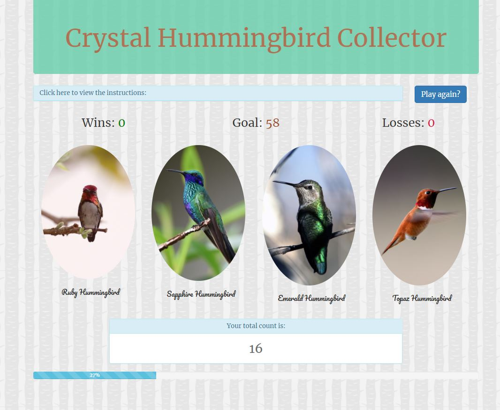

# Hummingbird Addition Game

## Overview

Here's how the app works:

   * There are four hummingbirds displayed as buttons on the page.

   * The player will be shown a random number at the start of the game.

   * When the player clicks on a hummingbird, it will add a specific amount of points to the player's total score. 

     * The game will hide this amount until the player clicks a crystal.
     * When they do click one, it updates the player's score counter.

   * The player wins if their total score matches the random number from the beginning of the game.

   * The player loses if their score goes above the random number.

     * When the game begins again, the player will see a new random number. Also, all the hummingbirds have four new hidden values. Of course, the user's score (and score counter) will reset to zero.

   * The app shows the number of games the player wins and loses. 

## Authors

* **Bethany Pfeister** 

## Acknowledgments

* UA Programming Bootcamp
